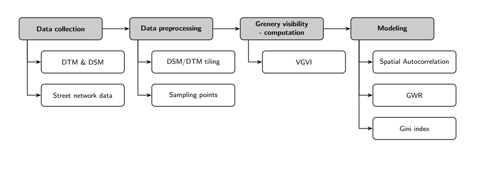

## Progress

| Week | Progress                                                                                                                                                                                                                                                                                                                                                                                                                                                                                                                                                       |
| ---- |----------------------------------------------------------------------------------------------------------------------------------------------------------------------------------------------------------------------------------------------------------------------------------------------------------------------------------------------------------------------------------------------------------------------------------------------------------------------------------------------------------------------------------------------------------------|
| Week 1 | - read relevant literature   - two relevant papers, among others:   1) Modelling and mapping eye-level greenness visibility exposure using multi-source data at high spatial resolutions by S.M. Labib, Jonny J. Huck, Sarah Lindley   2) Viewshed-based modelling of visual exposure to urban greenery – An efficient GIS tool for practical planning applications by Zofie Cimburova, Stefan Blumentrath                                                                                                                                            |
| Week 2 | - familiarized myself with the calculation of viewshed analysis, decay model, GVI, among others   - coded viewshed using python for Utrecht area   - duplicated the code using R                                                                                                                                                                                                                                                                                                                                                                         |
| Week 3 | - switched to a sample of Amsterdam area due to missing data around Utrecht   - created a mask of Amsterdam streets to exclude points outside of street network from the analysis   - used Labib's function to run the GVI on a small part of Amsterdam   - replicated the GVI in R   - created a mask for buildings instead of streets and replicate the analysis   - collected income data on buurts (neighbourhoods) for the entire Netherlands from CBS   - used parallelization to run the analysis for the entire Amsterdam area    
| Week 4 | - sampled  points 50m apart on linestrings street data from OSM    - coded a pipeline to get new data from AHN3 on DSM and DTM (both 0.5m or 5m available)   - scaled up and calculated GVI for four cities Rotterdam, Hague, Utrecht and Amsterdam.   - Created tiles of streets of the Netherlands in order to be able to download data on the entire country                                                                                                                                                                                    
| Week 5 | - Downloaded street data on the entire Netherlands using osmextract  - Coded a function that splits raster files into tiles to avoid memory issues with GVI   - Also, coded a function to split the street data into tiles   - Stored the tile files locally, looped through them to calculate GVI, and finally attached the results to a gdf                                                                                                                                                                                                      
| Week 6 | - investigated the feasibility of improving the DSM and DTM files   - calculated a percentage of missing values on a sampled region from the streets (<5%)   percentage of missing values for the entire netherlands   in process - obtain GVI for the entire Netherlands                                                                                                                                                                                                                                                                             
| Week 7 | - CY                                                                                                                                                                                                                                                                                                                                                                                                                                                                                                                                                           |
| Week 8 |                                                                                                                                                                                                                                                                                                                                                                                                                                                                                                                                                                |

# Analyzing Greenness Visibility in the Netherlands: A Viewshed-Based Approach and Socio-economic Modeling

The aim of this project is threefold: 
1) compute the tree visibility using viewshed-based approach for the entire Netherlands in a reproducible manner; 
2) analyse tree visibility inequality using weighted GINI index; 
3) model the relationship of tree visibility with selected socio-economic variables. 

## Dependencies

To successfully run this project, the following dependencies are required:

- `geopandas`: A library for working with geospatial data.
- `numpy`: A fundamental package for scientific computing with Python.
- `osmium`: A library for working with OpenStreetMap data.
- `shapely`: A Python package for manipulation and analysis of geometric objects.
- `rasterio`: A library for reading and writing raster data.

## Workflow
The workflow of this project follows a sequence of steps as illustrated below. 

**Step 1 - data collection:** the data is collected for digital surface model (DSM), 
digital terrain model (DTM) from Actueel Hoogtebestand Nederland (AHN) in 1020 tiles
for each model. Tree coverage data is obtained from Atlas living environemnt, street data using
Python's library _pyrosm_ and socio-economic variables using _cbsodata_ library.

**Step 2 - preprocess data:** both DTM and DSM data models are merged into one tif file, 
which is subsequently divided into larger tiles consisting of 10 individual tiles each. The division 
is done by defining a spatial extent of the area (the Netherlands in this case). This step 
is necessary for computational efficiency, while minimazing the need for cropping
the street data (had the initial 1000 tiles were preserved). The street data is obtained 
in .pbf format, hence converted and preprocessed into .gpkg. The street geometries data are 
sampled at 50 metres intervals; if its linestring is shorter than 50 meters, a point is taken 
at its centroid. The tree dataset is converted into a binary based on cell threshold 10 to 
to accurately represent the degree of detail of tree coverage. 

An additional sub-step involves checking the resolution of the DSM, DTM, and 
tree datasets. Since the tree dataset has a resolution of 10x10, while the DSM and DTM had a 
resolution of 5x5, we downsampled the tree dataset to match the granularity of the DSM 
and DTM files.

**Step 3 - data quality check (optional):** this step follows a function that assesses the presence 
of missing data in the DSM and DTM files, as these files are often subject to missing data. 
A buffer of a specified length (specify according to the defined radius in the viewshed) is generated 
as a mask surrounding the streets. Consequently, only  the cells relevant to the VGVI calculation are evaluated.

**Step 4 - tree visibility computation:** this step is done in R for computational 
efficiency reasons. Folders with preprocessed DSM, DTM, tree data and street points
are inputted into a function, where VGVI score is calculated for each tile. 
Note that the street data input is included in its entirety as it has a relatively 
smaller size compared to the DSM and DTM LiDAR and tree datasets. Moreover, some tiles 
may contain only NaNs (e.g., a result of being in the ocean), hence the function checks 
for such a scenario prior to the computation. This check is necessary as the original VGVI
function does not account for this particular condition.

**Step 5 - VGVI validation:** the reults of the step 3 are validated by performing a 
coorelation between VGVI and Normalized Difference Vegetation Index (NDVI). 

**Step 6 - neighbourhood-level aggregation:** the resulting tree visibility is spatially merged
with two geodataframes obtained from cbs. One contains geometries and data for "buurt" 
(the smallest district) and the other one for "wijk" (a neighborhood composed of multiple buurts). 

**Step 7 - Modeling socio-economic variables and tree visibility:**
Modeling is done at the buurt level, with three sets of models: spatial 
autocorrelation models (Moran's Statistic, LISA, GI*), GINI index and GWR/MGWR. 
For the MGWR modeling a special _fastgwr_ package needs to be used to handle the 
data volume. 

# Results
