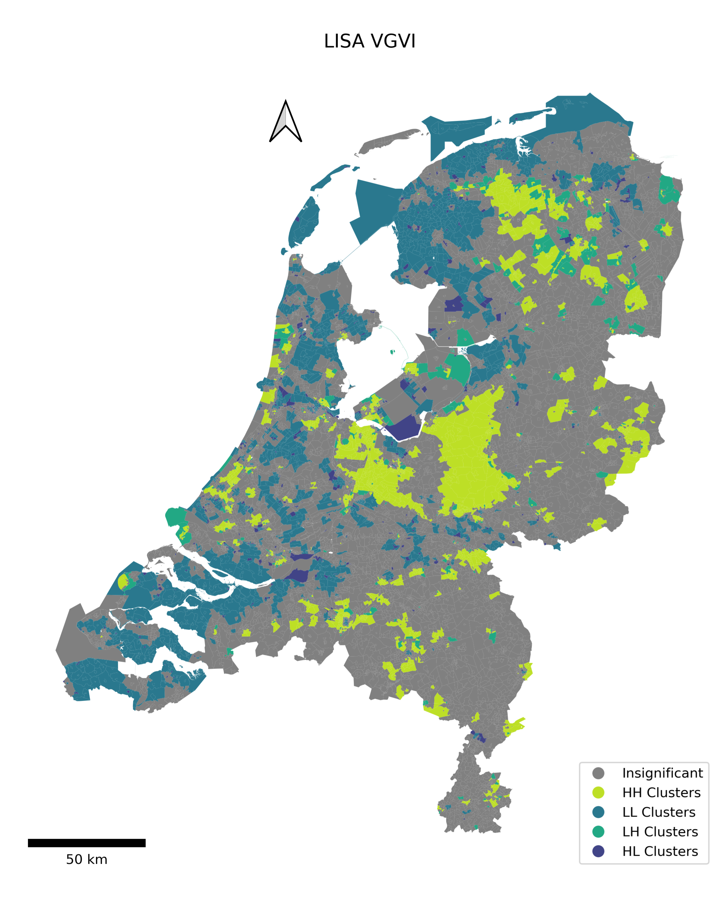
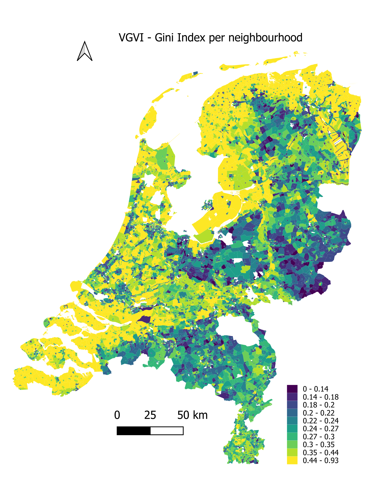

# Mapping Greenness Visibility in the Netherlands: A Viewshed-Based Approach and Socio-economic Modeling

**THE GITHUB README IS CURRENTLY BEING UPDATED**

The aim of this project is threefold: 
1) compute the tree visibility using viewshed-based approach for the entire Netherlands in a reproducible manner; 
2) analyse tree visibility inequality using weighted GINI index; 
3) model the relationship of tree visibility with selected socio-economic variables. 

## Dependencies

To successfully run this project, the following dependencies are required:

- `geopandas`: A library for working with geospatial data.
- `numpy`: A fundamental package for scientific computing with Python.
- `osmium`: A library for working with OpenStreetMap data.
- `shapely`: A Python package for manipulation and analysis of geometric objects.
- `rasterio`: A library for reading and writing raster data.

## Workflow
The workflow of this project follows a sequence of steps as illustrated below. 

**Step 1 - data extraction:** the data is collected for digital surface model (DSM), 
digital terrain model (DTM) from Actueel Hoogtebestand Nederland (AHN) in 1020 tiles
for each model. Tree coverage data is obtained from Atlas living environment, street data using
Python's library _pyrosm_ and socio-economic variables using _cbsodata_ library.

**Step 2 - preprocess data:** 
a) both DTM and DSM data models are merged into one tif file, 
which is subsequently divided into larger tiles consisting of 10 individual tiles each. The division 
is done by defining a spatial extent of the area (the Netherlands in this case). This step 
is necessary for computational efficiency, while minimazing the need for cropping
the street data (had the initial 1000 tiles were preserved). 

b) The street data is obtained in .pbf format, hence converted and preprocessed into .gpkg. 
The street geometries data are sampled at 50 metres intervals; if its linestring is shorter 
than 50 meters, a point is taken at its centroid. 

c) The tree dataset is converted into a binary 
based on cell threshold 10 to accurately represent the degree of detail of tree coverage.

d) An additional sub-step involves checking the resolution of the DSM, DTM, and 
tree datasets. Since the tree dataset has a resolution of 10x10, while the DSM and DTM had a 
resolution of 5x5, we downsampled the tree dataset to match the granularity of the DSM 
and DTM files.

**Step 3 - data quality check (optional):** this step follows a function that assesses the presence 
of missing data in the DSM and DTM files, as these files are often subject to missing data. 
A buffer of a specified length (specify according to the defined radius in the viewshed) is generated 
as a mask surrounding the streets. Consequently, only  the cells relevant to the VGVI calculation are evaluated.

**Step 4 - tree visibility computation:** this step is done in R for computational 
efficiency reasons. Folders with preprocessed DSM, DTM, tree data and street points
are inputted into a function, where VGVI score is calculated for each tile. 
Note that the street data input is included in its entirety as it has a relatively 
smaller size compared to the DSM and DTM LiDAR and tree datasets. Moreover, some tiles 
may contain only NaNs (e.g., a result of being in the ocean), hence the function checks 
for such a scenario prior to the computation. This check is necessary as the original VGVI
function does not account for this particular condition.

**Step 5 - VGVI validation:** the reults of the step 3 are validated by performing a 
Pearson's coorelation between VGVI and Normalized Difference Vegetation Index (NDVI). 

**Step 6 - neighbourhood-level aggregation:** the resulting tree visibility is spatially merged
with two geodataframes obtained from cbs. One contains geometries and data for "buurt" 
(the smallest district) and the other one for "wijk" (a neighborhood composed of multiple buurts). 

**Step 7 - Modeling socio-economic variables and tree visibility:**
Modeling is done at the buurt level, with three sets of models: spatial 
autocorrelation models (Moran's Statistic, LISA, GI*), GINI index and GWR/MGWR. 
For the MGWR modeling a special _fastgwr_ package needs to be used to handle the 
data volume(see dependencies). 

# Results

### VGVI result
The below image represents the final calculation of the VGVI for 
the entire Netherlands at three levels:

### Spatial autocorrelation
The below image shows significant clusters of LISA's local spatial autocorrelations, 
where high–high (HH) represents hotspots, low-low (LL) represents coldspots, 
and LH and HL represent spatial outliers:

  

### GINI index
The below image shows the weighted Gini index by population and its 
results on the neighbourhood-level VGVI.

  

### MGWR 
The below image shows the MGWR coefficients of the factors examined in the spatial context. The greyed-out area 
represents a non-significant spatial extent of coefficients. 

  

